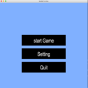
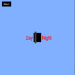
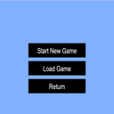
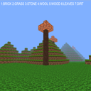
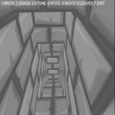
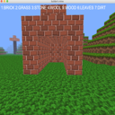
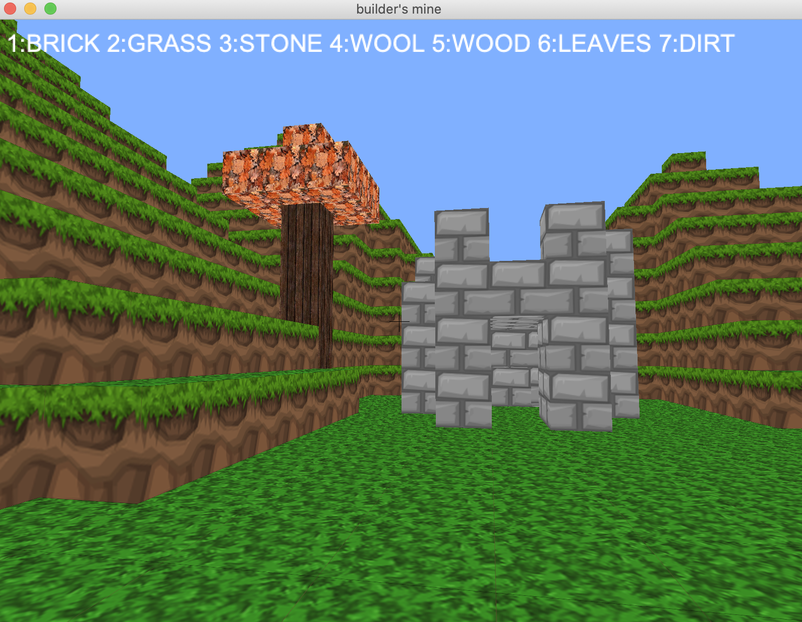

# builders-mine

## minecraft like game using Pyglet

### install

```bash
git clone https://github.com/jdszekeres/builders-mine.git
cd builders-mine
pip install -r requirements.txt
python3 main.py
```
### screenshots
main screen

day and night switch

choose game options

tree

mining

houses



### known issues

* player will kepp moving after key release
